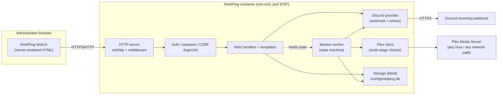
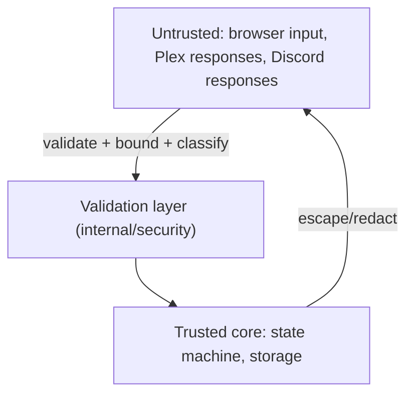

# ReelPing — Architecture

ReelPing is a single, self-contained Go binary that runs in a container, stores
everything in one embedded database under `/config`, monitors a Plex server over
the network, and sends Discord webhook notifications. There is no external
database, message broker, frontend container, or developer-hosted dependency.

> ReelPing is an independent community project and is not affiliated with or
> endorsed by Plex, Inc., Discord Inc., or Lime Technology, Inc.

---

## 1. High-level component diagram

Outbound network connections are strictly limited to **the configured Plex
server** and **the configured Discord webhook**. Nothing else is contacted.

---

## 2. Package layout (`internal/`)

| Package | Responsibility |
| --- | --- |
| `version` | Build metadata (version, commit, date) injected via `-ldflags`. |
| `security` | Input validation: URLs, hostnames, ports, role IDs, machine IDs, text sanitisation, secret redaction, security headers. |
| `config` | Typed configuration model + validation + monitoring presets. |
| `storage` | bbolt wrapper: buckets, schema/migrations, atomic backup, typed accessors for every persisted entity. |
| `auth` | Argon2id hashing, server-side sessions, CSRF tokens, login rate limiting. |
| `plex` | Plex client and the multi-stage availability check (URL → DNS → TCP → HTTP `/identity` → authenticated identity/sessions). Returns a classified `CheckResult`. |
| `discord` | Notification provider interface + Discord webhook implementation: embed building, `allowed_mentions`, escaping, bounded retries, redaction. |
| `monitoring` | The persisted state machine, the polling worker, incident lifecycle, maintenance suppression, injectable clock. |
| `web` | HTTP handlers, middleware, template rendering, setup wizard, dashboard, settings, diagnostics, embedded static assets. |

`cmd/reelping` wires everything together and owns process lifecycle
(startup, health-check subcommand, graceful shutdown).

---

## 3. Request / trust boundaries

Everything crossing a boundary is treated as untrusted:

- **Browser input** → validated, length-limited, HTML-escaped on output, CSRF
  checked, and never reflected unescaped.
- **Plex responses** → read through a size-bounded reader, parsed with a
  tolerant XML decoder, and never rendered as HTML or executed.
- **Discord responses** → status categorised; bodies are not stored verbatim.

Secrets (Plex token, Discord webhook, session/CSRF secrets, password hash)
never leave the trusted core: they are excluded from logs, diagnostics,
exports, HTML, and process arguments.

---

## 4. Concurrency model

- **One monitor goroutine** owns all monitoring state transitions. It runs on a
  ticker and holds an internal mutex; a run cannot overlap itself, so there is
  never more than one in-flight check against Plex.
- **HTTP handlers** read a snapshot of monitor state through a read-locked
  accessor; they never mutate state machine internals directly. State-changing
  admin actions (start maintenance, send announcement, change settings) are
  serialised through the monitor/storage layer.
- **Storage** relies on bbolt's serializable transactions; all multi-step
  updates happen in a single `Update` transaction.
- **Discord delivery** is performed by the caller with bounded retries; an
  event-level idempotency key prevents duplicate sends on browser refresh.

---

## 5. Timekeeping

- Durations (outage length, stabilisation, cooldown) are measured with a
  monotonic clock via an injectable `Clock` interface, so NTP jumps and DST
  transitions cannot corrupt them.
- Absolute event timestamps are stored in **UTC** and rendered in the
  administrator's configured time zone at display time.
- The injectable clock lets the test suite advance virtual time, so
  "one-minute outage" behaviour is tested without real waits.

---

## 6. Persistence overview

Single bbolt file, one bucket per concern:

| Bucket | Contents |
| --- | --- |
| `meta` | schema version, install ID, monotonic counters. |
| `config` | general/Plex/monitoring/Discord/security settings (secrets stored redacted-at-read). |
| `admin` | administrator account (username + Argon2id hash). |
| `sessions` | active server-side sessions. |
| `monitor_state` | persisted state machine snapshot + active incident pointer. |
| `incidents` | outage incident records (retained). |
| `maintenance` | scheduled + active maintenance windows. |
| `announcements` | announcement history. |
| `notifications` | Discord delivery records (sanitised). |
| `audit` | administrative/audit events. |
| `idempotency` | recently used idempotency keys (bounded). |

Retention is enforced by a periodic sweeper (see `docs/CONFIGURATION.md`).

See `docs/INCIDENT-STATE-MACHINE.md` for the monitoring state machine and
`docs/MONITORING.md` for the multi-stage check pipeline.
