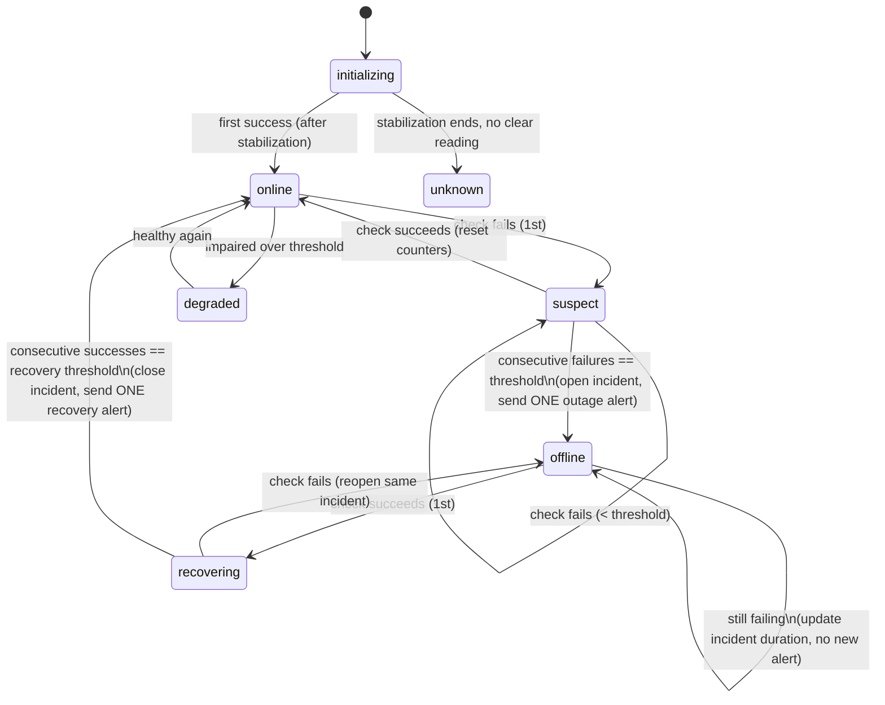
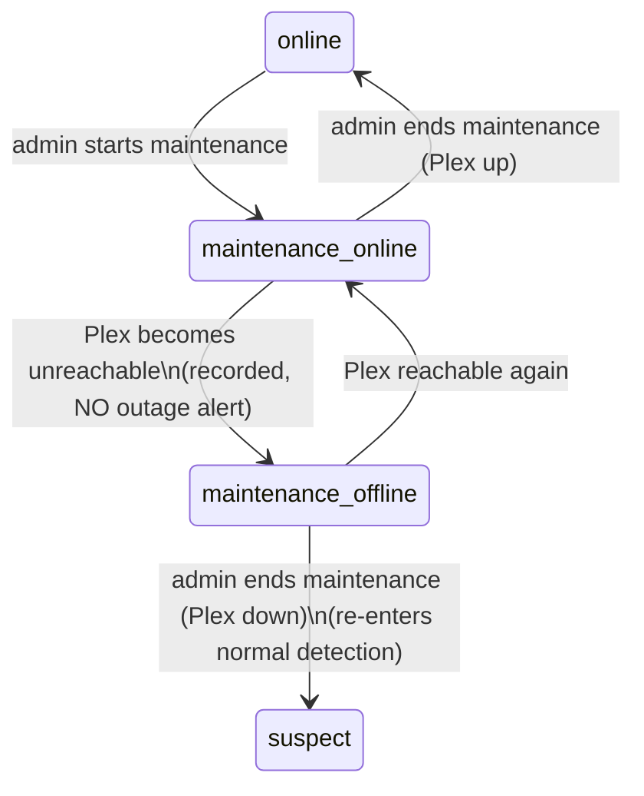
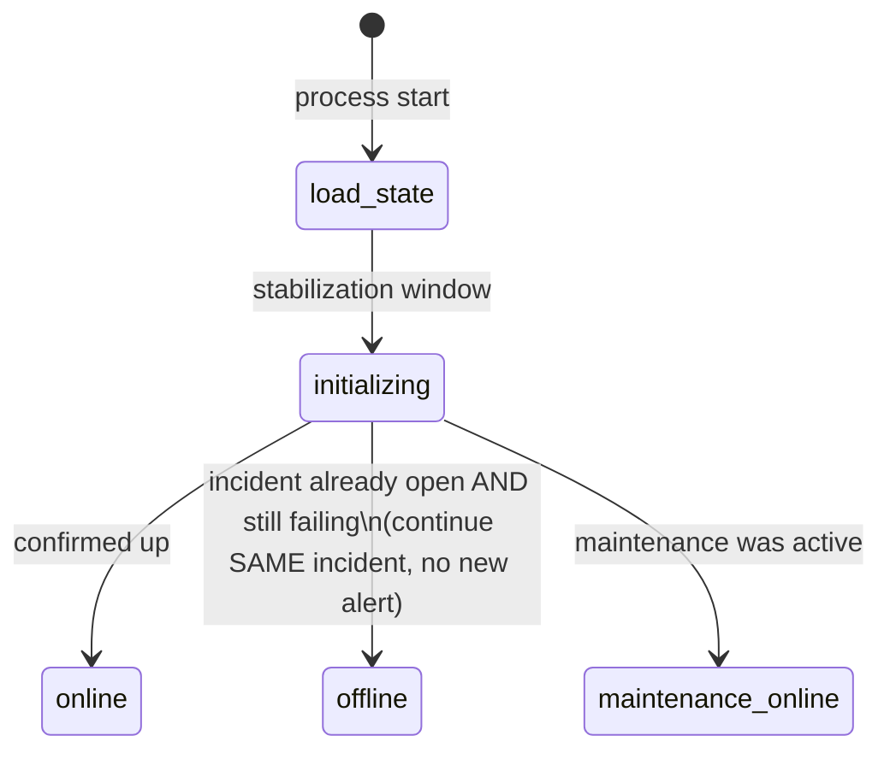

# ReelPing — Monitoring State Machine

ReelPing models Plex availability as an explicit, persisted state machine. The
machine is deliberately hysteretic: a single failed or successful check never
changes the world. Outages are only *confirmed* after N consecutive failures,
and recovery only after M consecutive successes. This is what turns a noisy
20-second poll into "approximately one clear notification per real event".

> Defaults referenced below are the **Balanced** preset: check interval 20 s,
> failure threshold 3, recovery threshold 2, startup stabilisation 60 s.

---

## 1. States

| State | Meaning |
| --- | --- |
| `disabled` | Monitoring is off (setup incomplete or admin disabled it). |
| `initializing` | Worker is starting; inside the startup stabilisation window. |
| `unknown` | No confident reading yet. |
| `online` | Plex responded successfully on the most recent confirmed reading. |
| `suspect` | At least one recent failure, but the failure threshold is not yet met. No notification sent. |
| `offline` | Failure threshold met; an incident is open and (if enabled) an outage notification was sent. |
| `recovering` | Plex responded again after an outage, but the recovery threshold is not yet met. |
| `degraded` | Plex is reachable but impaired (e.g. authenticated API failing, sustained high latency). Informational; no auto-notification by default. |
| `maintenance-online` | Maintenance mode active and Plex currently reachable. |
| `maintenance-offline` | Maintenance mode active and Plex currently unreachable (expected — no outage alert). |

---

## 2. Automatic outage / recovery transitions

### Worked example (Balanced preset)

| Tick | Result | State before → after | Notification |
| --- | --- | --- | --- |
| 1 | fail | `online` → `suspect` | none |
| 2 | fail | `suspect` → `suspect` | none |
| 3 | fail | `suspect` → `offline` | **1 outage alert**, incident opened |
| 4–20 | fail | `offline` → `offline` | none (duration updated) |
| 21 | success | `offline` → `recovering` | none |
| 22 | success | `recovering` → `online` | **1 recovery alert**, incident closed with duration |

With a 20 s interval and threshold 3, the outage is confirmed roughly
`interval × threshold = 60 s` after Plex actually goes down (actual time varies
by where the failure lands relative to the polling schedule).

---

## 3. Maintenance transitions

When the administrator starts or schedules maintenance, ReelPing enters
maintenance mode. While in maintenance, an unreachable Plex is *expected* and
does **not** raise an unexpected-outage alert.

- Ending maintenance while Plex is still down drops back into the normal
  detection path (`suspect`), so a genuine post-maintenance outage will still be
  caught.
- A recovery/"service restored" announcement can be sent automatically when Plex
  returns during a maintenance window, if the admin enabled that option.

---

## 4. Restart safety

On startup the worker:

1. Loads the persisted `monitor_state` snapshot and any open incident.
2. Enters `initializing` for the stabilisation window and performs fresh checks.
3. **Does not** emit an outage alert merely because ReelPing restarted.
4. **Does not** open a duplicate incident — if an incident was already open, it
   continues that same incident.
5. Restores an active maintenance window if one was in effect.

---

## 5. Counters and idempotency

- `consecutiveFailures` / `consecutiveSuccesses` are persisted so thresholds
  survive restarts.
- Each incident has a unique short ID. The outage alert and recovery alert for
  an incident each carry an idempotency key derived from the incident ID and
  phase, so a retry after recovery can never double-send.
- A notification cooldown prevents rapid re-alerting for flapping services.

---

## 6. Edge cases explicitly handled

- **Out-of-order / duplicate checks:** the worker is single-threaded and
  ticker-driven; a slow check cannot overlap the next one (runs are skipped, not
  stacked), so ordering is guaranteed.
- **Clock jumps / DST:** durations use a monotonic clock; only display uses wall
  time in the configured zone.
- **Threshold changes mid-incident:** applied to future evaluations; an already
  open incident stays open and is evaluated against the current recovery
  threshold.
- **Flapping:** cooldown + hysteresis prevent alert storms.
