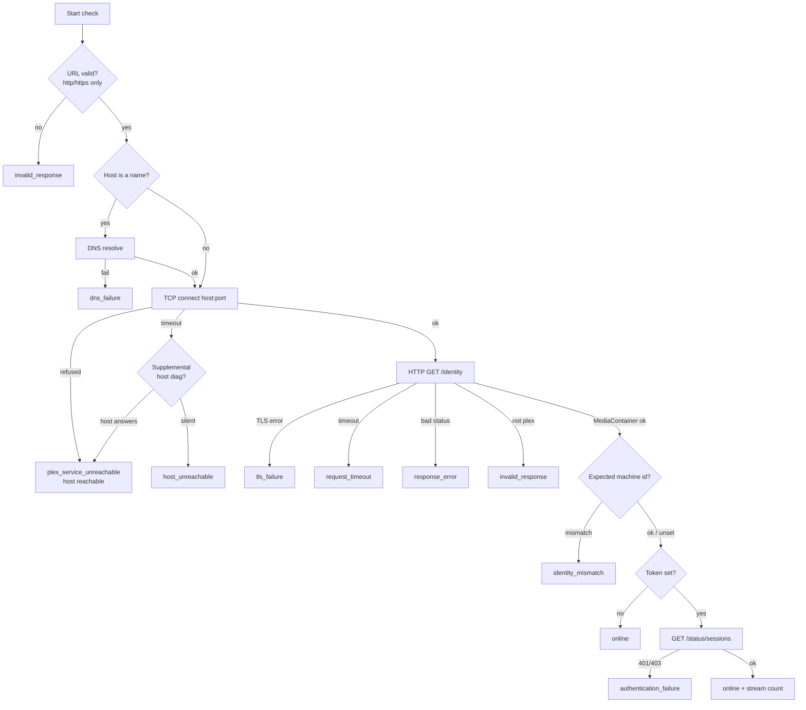

# ReelPing — Monitoring

ReelPing determines Plex availability with a **multi-stage active check**, run
on an interval by a single worker goroutine. It never uses a shell and never
relies on ICMP as the primary signal.

## The check pipeline

## Stages

1. **URL validation** — only `http`/`https`; rejects credentials-in-URL,
   control characters, and bad ports.
2. **DNS resolution** — only for hostnames; failures are classified separately.
3. **TCP connectivity** — a bounded dial. *Connection refused* means the host is
   up but Plex isn't listening (`plex_service_unreachable`); a timeout may mean
   the host is down.
4. **HTTP `/identity`** — a bounded request to Plex's unauthenticated identity
   endpoint. The response must parse as a `MediaContainer` with a
   `machineIdentifier`. Response size, redirect count, and total time are all
   capped; redirects to non-HTTP(S) schemes are refused.
5. **Authenticated verification** (token set) — compares the machine identifier
   to the expected one (`identity_mismatch` on divergence), reads the friendly
   name, and reads **only the size** of `/status/sessions` for a stream count.
   A `401/403` is `authentication_failure`.
6. **Supplemental host diagnostics** (optional) — when a dial times out, ReelPing
   probes a couple of common ports to decide *host down* vs *service down*. It
   does **not** use ICMP (which needs privileges and is often blocked).

## Why not ICMP?

A host can answer ping while Plex is stopped, crashed, or frozen. ICMP would
report "up" during a real outage. ReelPing therefore uses HTTP as the source of
truth and treats host reachability as a *supplemental* signal derived from TCP
behaviour.

## Presets

| Preset | Interval | Timeout | Failures | Recovery | ~Confirm |
| --- | --- | --- | --- | --- | --- |
| Fast | 15 s | 4 s | 4 | 2 | ~60 s |
| **Balanced** (default) | 20 s | 5 s | 3 | 2 | ~60 s |
| Conservative | 30 s | 5 s | 3 | 2 | ~90 s |
| Custom | ≥10 s | < interval | ≥2 | ≥1 | interval × failures |

Confirmation time is approximately `check interval × failure threshold`. Actual
detection time varies depending on where the failure lands in the polling
schedule.

## Safety bounds (custom preset)

- Interval ≥ 10 s.
- Timeout ≥ 1 s and strictly **less than** the interval.
- Failure threshold ≥ 2 (prevents one-off false alerts).
- Only one check runs at a time (the worker is single-threaded and ticker-driven,
  so a slow check cannot overlap the next).

## Degraded state

Optionally, sustained high latency (over a configurable threshold across a
number of checks) marks Plex `degraded`. This is shown in the UI but **not**
auto-notified by default. See [INCIDENT-STATE-MACHINE.md](INCIDENT-STATE-MACHINE.md)
for the full state machine.
